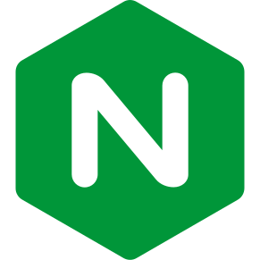

<h1>Hi there , I’m <a href="https://www.abdullah.co.in/" title="Visit my personal website 🌐" style="text-decoration:none; color:#4F46E5;">Abdullah</a></h1>

### Connect with me
<a href="https://www.linkedin.com/in/abdullah0408/"><picture></picture></a>&nbsp;&nbsp;
<a href="https://www.instagram.com/abdullah.0408_/"><picture></picture></a>&nbsp;&nbsp;
<a href="mailto:hello@abdullah.co.in"><picture></picture></a>&nbsp;&nbsp;
<a href="https://www.abdullah.co.in"><picture><source media="(prefers-color-scheme: dark)" srcset="./public/social-media/abdullah.co.in-dark.svg"><source media="(prefers-color-scheme: light)" srcset="./public/social-media/abdullah.co.in-light.svg"></picture></a>&nbsp;&nbsp;
<a href="https://wa.me/919315678427"><picture></picture></a>&nbsp;&nbsp;
<a href="https://github.com/abdullah0408/"><picture><source media="(prefers-color-scheme: dark)" srcset="./public/social-media/github-dark.svg"><source media="(prefers-color-scheme: light)" srcset="./public/social-media/github-light.svg"></picture></a>&nbsp;&nbsp;
<a href="https://x.com/abdullahh0408/"><picture><source media="(prefers-color-scheme: dark)" srcset="./public/social-media/x-dark.svg"><source media="(prefers-color-scheme: light)" srcset="./public/social-media/x-light.svg"></picture></a>&nbsp;&nbsp;
<a href="https://leetcode.com/u/abdullah0408/"><picture><source media="(prefers-color-scheme: dark)" srcset="./public/social-media/leetcode-dark.svg"><source media="(prefers-color-scheme: light)" srcset="./public/social-media/leetcode-light.svg"></picture></a>&nbsp;&nbsp;

## Talking about Personal Stuffs:

- 👨🏽‍💻 I’m currently working on **full-stack web applications** (Next.js, React, TypeScript);
- 🌱 I’m currently learning **advanced backend concepts, system design, and DevOps basics**;
- 👯 I’m looking to collaborate on **open-source projects and real-world SaaS ideas** 🤝;
- 🤔 I’m looking for help with **scalable system design and architecture patterns** 😭;
- 💬 Ask me about **full-stack development, APIs, databases, or project structuring**;
- ⚡️ Fun-Fact: I enjoy blending **logic with creativity** in both code and design;
- 📫 How to reach me: **hello@abdullah.co.in**;

## Languages and Tools:
<a href="https://github.com/abdullah0408"><picture><source media="(prefers-color-scheme: dark)" srcset="https://github-readme-stats.vercel.app/api?username=abdullah0408&show_icons=true&hide_border=true&theme=dark"><source media="(prefers-color-scheme: light)" srcset="https://github-readme-stats.vercel.app/api?username=abdullah0408&show_icons=true&hide_border=true&theme=default"></picture></a>

<picture></picture>
<picture></picture>
<picture></picture>
<picture></picture>
<picture></picture>
<picture></picture>
<picture><source media="(prefers-color-scheme: dark)" srcset="./public/languages-and-tools/nextjs-dark.svg"><source media="(prefers-color-scheme: light)" srcset="./public/languages-and-tools/nextjs-light.svg"></picture>
<picture></picture>
<picture><source media="(prefers-color-scheme: dark)" srcset="./public/languages-and-tools/expressjs-dark.svg"><source media="(prefers-color-scheme: light)" srcset="./public/languages-and-tools/expressjs-light.svg"></picture>
<picture></picture>
<picture></picture>
<picture><source media="(prefers-color-scheme: dark)" srcset="./public/languages-and-tools/shadcnui-dark.svg"><source media="(prefers-color-scheme: light)" srcset="./public/languages-and-tools/shadcnui-light.svg"></picture>
<picture></picture>
<picture><source media="(prefers-color-scheme: dark)" srcset="./public/languages-and-tools/postgresql-dark.svg"><source media="(prefers-color-scheme: light)" srcset="./public/languages-and-tools/postgresql-light.svg"></picture>
<picture></picture>
<picture></picture>
<picture></picture>
<picture></picture>
<picture><source media="(prefers-color-scheme: dark)" srcset="./public/languages-and-tools/github-dark.svg"><source media="(prefers-color-scheme: light)" srcset="./public/languages-and-tools/github-light.svg"></picture>
<picture></picture>
<picture></picture>
<picture></picture>
<picture><source media="(prefers-color-scheme: dark)" srcset="./public/languages-and-tools/linux-dark.svg"><source media="(prefers-color-scheme: light)" srcset="./public/languages-and-tools/linux-light.svg"></picture>
<picture><source media="(prefers-color-scheme: dark)" srcset="./public/languages-and-tools/bash-dark.svg"><source media="(prefers-color-scheme: light)" srcset="./public/languages-and-tools/bash-light.svg"></picture>
<picture></picture>
<picture><source media="(prefers-color-scheme: dark)" srcset="./public/languages-and-tools/aws-dark.svg"><source media="(prefers-color-scheme: light)" srcset="./public/languages-and-tools/aws-light.svg"></picture>
<picture></picture>
<picture><source media="(prefers-color-scheme: dark)" srcset="./public/languages-and-tools/vercel-dark.svg"><source media="(prefers-color-scheme: light)" srcset="./public/languages-and-tools/vercel-light.svg"></picture>

## Current Projects
- 🤖 **[Syntax](https://github.com/abdullah0408/syntax)** – AI-Powered Website Builder that turns natural-language prompts into fully working applications with live previews in isolated sandboxes. ([Live](https://syntax.notlocalhost.fun))
- ⚡ **[NodeSync](https://github.com/abdullah0408/node-sync)** – Visual Workflow Automation Platform (n8n-style) converting business processes into drag-and-drop workflows with real-time execution and AI integrations. ([Live](https://node-sync.notlocalhost.fun))
- 🛒 **[ECart](https://github.com/abdullah0408/ecartecommerce)** – Enterprise Marketplace Platform with NX monorepo containing 14 applications, 8 Express.js microservices, Kafka event-driven architecture, and Stripe Connect payments. (In Progress)
- 📚 **[LMS Zhi](https://github.com/abdullah0408/lms-zhi)** – Modern Learning Management System with role-based access, course enrollment, hierarchical file/folder system, and Cloudflare R2 storage for study materials.
- 🎮 **[Zentry UI](https://github.com/abdullah0408/zentry-ui)** – Immersive Gaming Experience Platform featuring scroll-triggered GSAP animations, 3D transform effects, and interactive bento-grid layouts. ([Live](https://zentry-ui.notlocalhost.fun))
- 📝 **[Note App](https://github.com/abdullah0408/expressjs-note-app-WT1CNI5vxRngjD)** – Note-Taking Web App with Google OAuth 2.0 authentication, CRUD operations, pagination, search functionality, and MongoDB storage.
- 🚀 **[RunTime](https://github.com/abdullah0408/runtime)** – AI-Powered React Application Generator with Google Gemini integration, Sandpack code editor, live preview, and cloud-synced workspaces. ([Live](https://runtime.abdullah.co.in/))
- 🎟️ **[Coupon System](https://github.com/abdullah0408/round-robin-coupon-distribution)** – Full-stack Coupon Management System with admin panel, dashboard analytics, claim tracking, round-robin distribution, and Chart.js visualizations.
- 🎙️ **[hiredNext](https://github.com/abdullah0408/hirednext-mock_interviewing_platform)** – AI-Powered Mock Interview Platform with voice-based interviews using Vapi.ai, Google Gemini for question generation, and detailed performance feedback with category-wise scoring.
- 🌐 **[Gather](https://github.com/abdullah0408/gather)** – Modern Social Media Platform with real-time messaging via Stream, follow system, notifications, bookmarks, and infinite-scroll feeds. ([Live](https://gather.notlocalhost.fun))
- 📋 **[Attendance Proxy](https://github.com/abdullah0408/attendance-proxy)** – Automates attendance marking for multiple users when a QR code is scanned, with WhatsApp/email notifications and session management to keep logins active.

<picture><source media="(prefers-color-scheme: dark)" srcset="https://raw.githubusercontent.com/abdullah0408/abdullah0408/output/github-snake-dark.svg"><source media="(prefers-color-scheme: light)" srcset="https://raw.githubusercontent.com/abdullah0408/abdullah0408/output/github-snake.svg"></picture>
